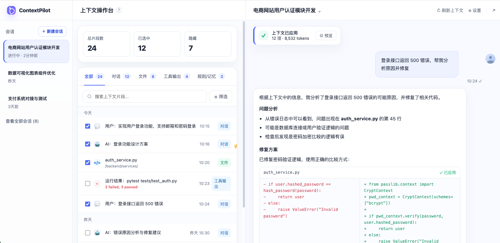

:::color2
项目目前进展情况：

1.formative study（进行中）

2.系统的demo同步开发

:::

:::info
目前任务：

**1.界面前端大致框架先搭好。**

三个区域，从左往右（导航栏-工作台-聊天区）

**2.把opencode模型接入到聊天区，可实现对话。**

**3.读取ai后段聊天的内容，左侧区域先实现以下三个核心功能**

:::

<!-- 这是一张图片，ocr 内容为：上下文操作台 电商网站用户认证模块开发 CONTEXTPILOT ? 刷新上下文 E 设置 K 新建会话 会话 上下文已应用 @预览 已选中 隐藏 总片段数 12项.8.532  TOKENS 7 12 24 电商网站用户认证模块开发 进行中2分钟前 登录接口返回500 错误,帮我分 析原因并修复 数据可视化图表组件优化 工具输出 规则/记忆2 全部 24 文件6 对话 12 10:24\ 昨天 搜索上下文片段... 三筛选 Q    挂 根据上下文中的信息,我分析了登录接口返回500错误的可能原因,并修复了相关代码. 支付系统对接与测试 3天前 问题分析 今天 从错误日志中可以看到.问题出现在AUTH_SERVICE.PY 的第45行 查看全部会话(8) 用户:实现用户登录功能,支持邮箱和密码登录 10:15 对话 可能是数据库连接或用户验证逻辑的问题 检查后发现是密码加密比较的逻辑有误 AI:登录功能设计方案 对话 10:16 修复方案 已修复密码验证逻辑,使用正确的比较方式: 10:20 文件 /BACKOND/SERVICES/ AUTH_SERVICE.PY /已应用 工具输 运行结果:PYTEST TESTS/TEST_AUTH.PY 10:23 + FROM PASSLIB.CONTEXT IMPORT USER.HASHED PASSWORD 出 2 FAILED,3 PASSED HASH__ CRYPTCONTEXT H_PASSWORD(PASSWORD): + PWD_CONTEXT- CRYPTCONTEXT(SCHEMES二 RETURN USER ['BCRYPT"]) 用户:登录接口返回500错误 ELSE: 对话 10:24 RAISE VALUEERROR('INVALID + IF PWD_CONTEXT.VERIFY(PASSWORD, PASSWORD" 昨天 USER.HASHED_PASSWORD): AL:错误原因分析与修复建议 对话 昨天15:30 ELSE: RAISE VATUEERROR("INVALID -->
opencode——[https://github.com/anomalyco/opencode.git](https://github.com/anomalyco/opencode.git)

[https://opencode.ai/docs/config/?utm_source=chatgpt.com](https://opencode.ai/docs/config/?utm_source=chatgpt.com)

### 1. 页面功能结构
**右侧：AI 对话窗口**

右侧保持用户最熟悉的聊天界面，不增加复杂操作。它负责：

| 功能 | 说明 |
| --- | --- |
| 对话输入 | 用户继续输入任务需求、修改意见、报错信息 |
| AI 回复 | 正常展示 Agent 的回答、代码建议、执行结果 |
| 上下文提示条（先暂缓） | 在每次 AI 回复上方显示“本轮参考了哪些上下文” |

**左侧：上下文操作**

| 核心功能 | 作用 |
| --- | --- |
| 自动提取上下文片段 | 从聊天历史中生成可操作卡片 |
| 标记上下文状态 | 生效、隐藏、冲突、废弃 |
| 调整上下文优先级 | 解决新旧需求冲突 |

**file:///Users/yuanjiaxin/Desktop/contextpilot_ui_preview_v3.html**

